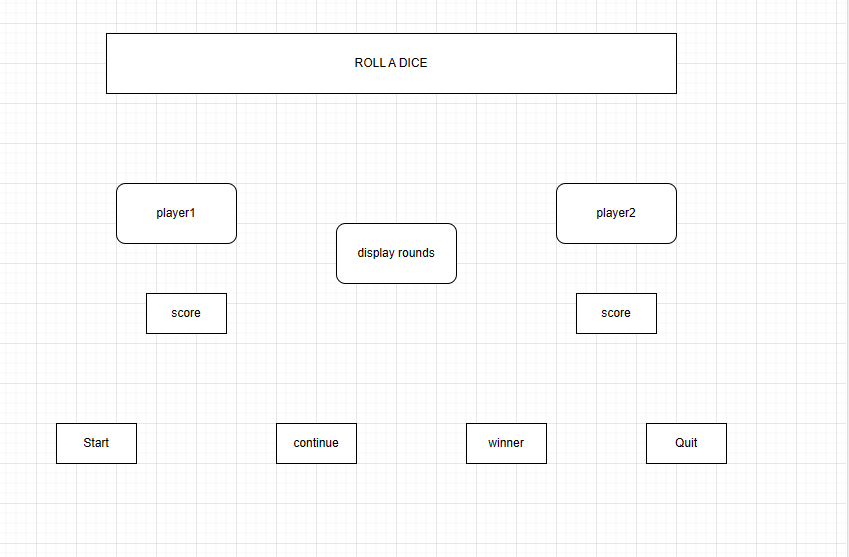
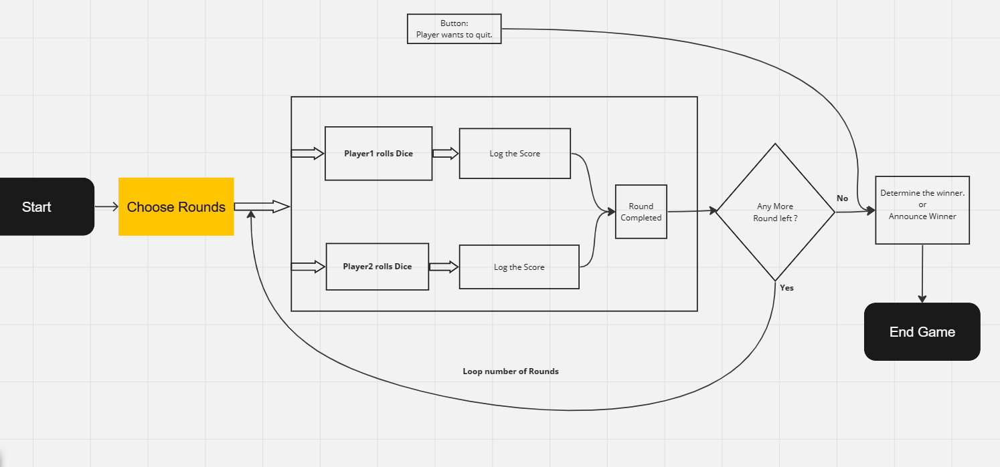

# 1. Project's Title

   "Roll The Dice"

# 2. Project Description:

     Dice game project: It is a 2 player game. 
     Added a input box to choose rounds to play. 
     Choose number of rounds and hit Enter button, it displays the instruction to start game.
     Start button will kick off rolling the dice for each player for choosen number of rounds and stores each round result in an array. 
     Each Player's combined score (summed up score of all the rounds played) will be displayed. 
     Winner button will announce the winner name.
     Continue button will enable next game and resets the number of rounds. Player can choose the number of rounds and start playing all over again.
     Quit button will diable all buttons and it is required to refresh the page to play again.
     Each button will display instructions for player.

#  3. Technologies used:

     html
     css
     javaScript
     DOM

#  4. Images

      https://pixabay.com/

#  5. Include Credits  

     For css styling i did check https://css-tricks.com/
     For DOM concept  https://www.w3schools.com/ , https://www.geeksforgeeks.org/ ,https://stackoverflow.com/..
     Thanks to these sites,helped to complete my game.

# Wireframe

# Flow Chart
